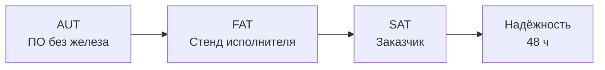

# Программа и методика испытаний (ПМИ)

Проверка соответствия роботизированной сварочной системы требованиям ТЗ.

**Основание:** раздел 5 ТЗ, Приложение Ш (матрица требований), FMEA (Приложение Т)  
**Связь с кодом:** [TRACEABILITY.md](TRACEABILITY.md)  
**Версия:** 1.0 · 2026-07-08

---

## 1. Общие положения

### 1.1 Цель

Подтвердить выполнение функциональных и метрологических требований ТЗ на этапах:

| Этап | Где | Когда |
|---|---|---|
| **Автономные (AUT)** | Windows / CI, без робота | Фазы 0–2 |
| **Заводские (FAT)** | Стенд исполнителя | Фаза 4–5 |
| **Приёмочные (SAT)** | Площадка заказчика | Фаза 8 |

### 1.2 Состав комиссии

- Представитель заказчика (председатель)
- Главный конструктор / технолог
- Руководитель разработки ПО
- Инженер по метrologии
- Представитель исполнителя

### 1.3 Условия испытаний

| Параметр | Значение |
|---|---|
| Температура | +20 ± 5 °C |
| Питание | 380 В / 50 Гц, заземление ≤ 4 Ом |
| Сеть | Ethernet ≥ 100 Мбит/с |
| Сжатый воздух | 6 бар, класс ISO 8573-1 |
| ПО | Версия из git tag, протокол сборки |

### 1.4 Эталонные образцы

| ID | Наименование | Назначение |
|---|---|---|
| REF-01 | Калибровочная пластина с реперными точками | Калибровка, ICP ground truth |
| REF-02 | T-образная деталь (STEP + физ.) | Швы, reachability |
| REF-03 | Деталь с 5+ швами разных типов | Распознавание ≥ 98% |
| REF-04 | Деталь с заведомым смещением ±2 мм | Компенсация установки |
| REF-05 | Контрольный сварной образец | PASS/FAIL QC |

*REF-01 — калибровочное приспособление из комплекта поставки (ТЗ §3.11).*

---

## 2. Виды испытаний

| Вид | Раздел ТЗ | Протокол |
|---|---|---|
| Автономные AUT | §4.3, Этап III | Протокол AUT-__ |
| FAT | §4.5 | Протокол FAT-__ |
| SAT | §5.2 | Протокол SAT-__ |
| Надёжность | §5.2 п.7, §3.8 | Журнал REL-48h |
| Безопасность | §3.10, Прил. Н | Протокол SAF-__ |

---

## 3. Тест-кейсы

Формат: **ID** · этап · требование (TRACEABILITY) · метод · **критерий PASS**

---

### Блок A — Автоматический цикл и FSM

#### TP-01 · AUT, FAT, SAT · TZ-1.1, TZ-9.9

**Автоматический цикл без оператора**

| Шаг | Действие |
|---|---|
| 1 | Загрузить REF-02, выбрать профиль из библиотеки |
| 2 | Запустить автоматический режим |
| 3 | Не вмешиваться до REPORT |

**PASS:** ≥ 10 циклов подряд; все переходы FSM корректны; при ошибке — EMERGENCY + запись в журнал.

---

#### TP-02 · AUT · TZ-1.2

**Работа со STEP**

| Шаг | Действие |
|---|---|
| 1 | Загрузить REF-02 STEP через UI |
| 2 | Выполнить scan → ICP → export |

**PASS:** деталь центрирована; швы найдены; plan JSON валиден.

---

#### TP-03 · AUT, FAT · TZ-1.2

**Работа без STEP (scan-only)**

| Шаг | Действие |
|---|---|
| 1 | Установить REF-02 без CAD |
| 2 | Медленное сканирование → построение модели → швы |

**PASS:** цикл завершён ≤ 40 мин (ТЗ §3.3.10 п.11); траектория построена.

---

### Блок B — Vision и ICP

#### TP-11 · AUT · TZ-2.5–2.7

**Конвейер фильтрации облака**

| Шаг | Действие |
|---|---|
| 1 | Подать синтетическое облако с 5% outliers |
| 2 | SOR → Voxel → MLS |

**PASS:** outliers удалены; плотность ≤ заданного voxel; визуально гладкая поверхность.

---

#### TP-12 · AUT, FAT · TZ-2.8

**RANSAC базовые плоскости**

| Шаг | Действие |
|---|---|
| 1 | Скан REF-02 / sim |
| 2 | RANSAC fit ≥ 2 плоскости |

**PASS:** нормали в пределах ±2° от CAD; inlier ratio ≥ 85%.

---

#### TP-16 · AUT, FAT, SAT · TZ-3.1, TZ-3.2

**ICP RMS ≤ 0,10 мм**

| Шаг | Действие |
|---|---|
| 1 | Scan REF-01 или REF-02 со смещением ≤ 5 мм |
| 2 | ICP vs CAD / эталон |

**PASS:** RMS ≤ 0,10 мм на контрольных точках (≥ 20 точек); протокол с числом.

---

#### TP-17 · AUT, FAT · TZ-3.3, TZ-11.4

**Запрет сварки при ошибке ICP**

| Шаг | Действие |
|---|---|
| 1 | Подать облако с RMS > 0,10 мм (недостаточно точек) |
| 2 | Попытка export / start weld |

**PASS:** операция заблокирована; сообщение оператору; событие в журнале; FSM не переходит в WELDING.

---

#### TP-18 · FAT, SAT · TZ-3.5

**Успешность авто-определения положения ≥ 99%**

| Шаг | Действие |
|---|---|
| 1 | 100 циклов установки REF-02 со случайным смещением |
| 2 | Авто ICP каждый раз |

**PASS:** ≥ 99 успешных регистраций.

---

#### TP-20 · FAT, SAT · TZ-4.3

**Распознавание швов ≥ 98%**

| Шаг | Действие |
|---|---|
| 1 | REF-03: N швов с ground truth разметкой |
| 2 | Автопоиск + refinement по scan |

**PASS:** recall ≥ 98%; ложные срабатывания ≤ 2%.

---

### Блок C — Траектория и кинематика

#### TP-21 · AUT, FAT · TZ-4.4–4.6, TZ-4.8

**Качество waypoints**

| Шаг | Действие |
|---|---|
| 1 | Export plan для REF-02 |
| 2 | Проверить approach/weld/retract, ориентацию TCP |

**PASS:** непрерывность траектории; max Δjoint между точками в пределах лимитов; NURBS без скачков (если включено).

---

#### TP-22 · AUT, FAT, SAT · TZ-4.7

**Время построения ≤ 60 с**

| Шаг | Действие |
|---|---|
| 1 | REF-03, 10 швов |
| 2 | Хронометраж от scan complete до plan ready |

**PASS:** ≤ 60 с (среднее по 5 прогонам).

---

#### TP-24 · AUT, FAT · TZ-5.3, TZ-5.4

**Reachability**

| Шаг | Действие |
|---|---|
| 1 | `/api/check/reachability` для всех швов REF-02 |
| 2 | С positioner grid search |

**PASS:** reachable швы = green; unreachable не попадают в export без override.

---

#### TP-25 · FAT, SAT · TZ-5.5, TZ-5.6

**Collision check**

| Шаг | Действие |
|---|---|
| 1 | Plan с заведомой коллизией (torch ↔ table) |
| 2 | Запрос move_group / planner |

**PASS:** plan rejected; сварка заблокирована; событие FMEA #4.

---

#### TP-27 · FAT, SAT · TZ-5.8

**Точность TCP ±0,10 мм**

| Шаг | Действие |
|---|---|
| 1 | 20 контрольных точек на REF-01 |
| 2 | Robot pose vs laser tracker / CMM |

**PASS:** max error ≤ 0,10 мм; repeatability ≤ 0,05 мм.

---

### Блок D — ROS / MoveIt

#### TP-31 · FAT · TZ-6.4

**OMPL planning**

| Шаг | Действие |
|---|---|
| 1 | MoveIt demo + planning scene |
| 2 | Plan между waypoints REF-02 |

**PASS:** valid trajectory; no collision; execution in RViz.

---

#### TP-32 · FAT, SAT · TZ-6.5

**Исполнение траектории**

| Шаг | Действие |
|---|---|
| 1 | Отправить plan через rosbridge |
| 2 | `weld_planner_node` → arm_controller |

**PASS:** robot follows path; `/welding/plan_status` = success.

---

### Блок E — Сварка и QC

#### TP-36 · FAT · TZ-7.1

**Сварочный источник**

| Шаг | Действие |
|---|---|
| 1 | Dry-run: arc on/off по команде ПО |
| 2 | Чтение тока / U |

**PASS:** задержка команды ≤ 100 мс; параметры в журнале.

---

#### TP-43 · FAT, SAT · TZ-8.3

**PASS/FAIL контроль шва**

| Шаг | Действие |
|---|---|
| 1 | Сварить REF-05 (good) и образец с дефектом |
| 2 | Post-weld scan + анализ |

**PASS:** good → PASS; defective → FAIL; уведомление оператору.

---

#### TP-05 · FAT, SAT · TZ-1.4, TZ-8.4

**Цифровой паспорт шва**

| Шаг | Действие |
|---|---|
| 1 | Завершить полный цикл 1 шва |
| 2 | Проверить запись в БД + PDF |

**PASS:** ID детали, шов, оператор, параметры, 3D-профиль, PASS/FAIL, timestamp; PDF экспортируется.

---

### Блок F — Безопасность и FMEA

#### TP-59 · FAT, SAT · TZ-11.1

**Аварийный останов**

| Шаг | Действие |
|---|---|
| 1 | Запустить цикл WELDING |
| 2 | Нажать E-stop |

**PASS:** robot + source + table stop ≤ 500 мс; FSM → EMERGENCY; restart только после reset + confirm.

---

#### TP-52 · FAT · TZ-9.10, TZ-11.2

**FMEA сценарии (выборочно)**

| # | Сценарий | Инъекция | Ожидание |
|---|---|---|---|
| 1 | Потеря связи с роботом | disconnect Ethernet | E-stop, журнал |
| 2 | Потеря облака точек | stop scanner stream | retry scan |
| 3 | Ошибка ICP | bad cloud | запрет сварки |
| 4 | Коллизия | invalid plan | запрет запуска |
| 6 | Потеря газа | close valve | блокировка сварки |

**PASS:** реакция соответствует FMEA (Приложение Т).

---

#### TP-60 · FAT, SAT · TZ-11.3

**Блокировка двери**

| Шаг | Действие |
|---|---|
| 1 | Цикл в движении |
| 2 | Открыть защитную дверь |

**PASS:** немедленный stop; restart после закрытия + reset.

---

### Блок G — Калибровка

#### TP-57 · FAT, SAT · TZ-10.3

**RMS калибровки ≤ 0,05 мм**

| Шаг | Действие |
|---|---|
| 1 | Процедура калибровки по REF-01 |
| 2 | Проверка N контрольных точек |

**PASS:** RMS ≤ 0,05 мм; протокол сохранён.

---

### Блок H — Интеграции и надёжность

#### TP-47 · AUT, FAT · TZ-9.4

**REST API**

| Endpoint | Метод | PASS |
|---|---|---|
| `/api/health` | GET | 200 OK |
| `/api/convert/step` | POST | valid STL |
| `/api/align/icp` | POST | matrix + RMS |
| `/api/export/moveit` | POST | valid plan JSON |
| `/api/check/reachability` | POST | per-seam status |

---

#### TP-48 · FAT · TZ-9.5

**MQTT телеметрия**

**PASS:** события cycle_start, weld_complete, qc_result публикуются; subscriber получает JSON.

---

#### REL-48h · SAT · §5.2 п.7

**48 часов непрерывной эксплуатации**

| Шаг | Действие |
|---|---|
| 1 | Автоцикл REF-02 / REF-03 в loop |
| 2 | Мониторинг 48 ч |

**PASS:** 0 critical errors; MTBF event log; готовность ≥ 0,95.

---

## 4. Критерии приёмки SAT (сводка)

Система принимается при выполнении **всех** пунктов:

| # | Критерий | Тест |
|---|---|---|
| 1 | ICP RMS ≤ 0,10 мм | TP-16 |
| 2 | ≥ 10 автоциклов подряд | TP-01 |
| 3 | Геометрия швов по ТД | TP-43 + экспертиза |
| 4 | Цифровой паспорт шва | TP-05 |
| 5 | Реакция на аварии | TP-59, TP-52, TP-60 |
| 6 | 48 ч без critical errors | REL-48h |
| 7 | Комплект документации | Checklist §6 |
| 8 | Распознавание швов ≥ 98% | TP-20 |
| 9 | TCP ±0,10 мм | TP-27 |
| 10 | Время траектории ≤ 60 с | TP-22 |

---

## 5. Матрица: тест → этап → статус

| ID | AUT | FAT | SAT | Реализуем сейчас |
|---|---|---|---|---|
| TP-01 | ✓ | ✓ | ✓ | ❌ (нет FSM) |
| TP-02 | ✓ | ✓ | ✓ | ✅ |
| TP-11 | ✓ | — | — | ❌ |
| TP-16 | ✓ | ✓ | ✓ | ⚠️ |
| TP-17 | ✓ | ✓ | — | ❌ |
| TP-22 | ✓ | ✓ | ✓ | ⚠️ |
| TP-24 | ✓ | ✓ | — | ✅ |
| TP-25 | — | ✓ | ✓ | ❌ |
| TP-31–32 | — | ✓ | ✓ | ❌ |
| TP-43 | — | ✓ | ✓ | ❌ |
| TP-57 | — | ✓ | ✓ | ❌ (нет HW) |
| REL-48h | — | — | ✓ | ❌ |

---

## 6. Checklist документации (§6 ТЗ)

| # | Документ | FAT | SAT |
|---|---|---|---|
| 1 | Паспорт системы | — | ✓ |
| 2 | Руководство оператора | draft | ✓ |
| 3 | Руководство администратора | — | ✓ |
| 4 | Руководство по ТО | — | ✓ |
| 5 | Руководство программиста | draft | ✓ |
| 6 | Описание API | draft | ✓ |
| 7 | ПМИ (настоящий документ) | ✓ | ✓ |
| 8 | Протоколы испытаний | ✓ | ✓ |
| 9 | Инструкция по калибровке | — | ✓ |
| 10 | Исходные коды ПО | ✓ | ✓ |

---

## 7. Порядок устранения замечаний

1. Акт замечаний (ID теста, описание, severity: Critical / Major / Minor)
2. Исправление в согласованный срок
3. Повтор только failed тестов + regression smoke (TP-02, TP-16, TP-24)
4. Подписание протокола повторных испытаний

---

## 8. План прогонов по фазам ROADMAP

| Фаза | Минимальный набор тестов |
|---|---|
| 0 | TP-02, TP-21, TP-24, TP-47 |
| 1 | + TP-11, TP-12, TP-16, TP-20 |
| 2 | + TP-01, TP-17, TP-50, TP-51 |
| 3 | + TP-25, TP-31, TP-32, TP-22 |
| 4 | + TP-57, TP-27, TP-18 |
| 5 | + TP-36, TP-37, TP-40 |
| 6 | + TP-43, TP-05, TP-42 |
| 7 | + TP-48, TP-52, TP-59, TP-46 |
| 8 | Full SAT + REL-48h |

---

## Связанные документы

- [TRACEABILITY.md](TRACEABILITY.md)
- [ROADMAP.md](ROADMAP.md)
- [TZ_Robot_Welding_System_Full_v2.docx](TZ_Robot_Welding_System_Full_v2.docx)
